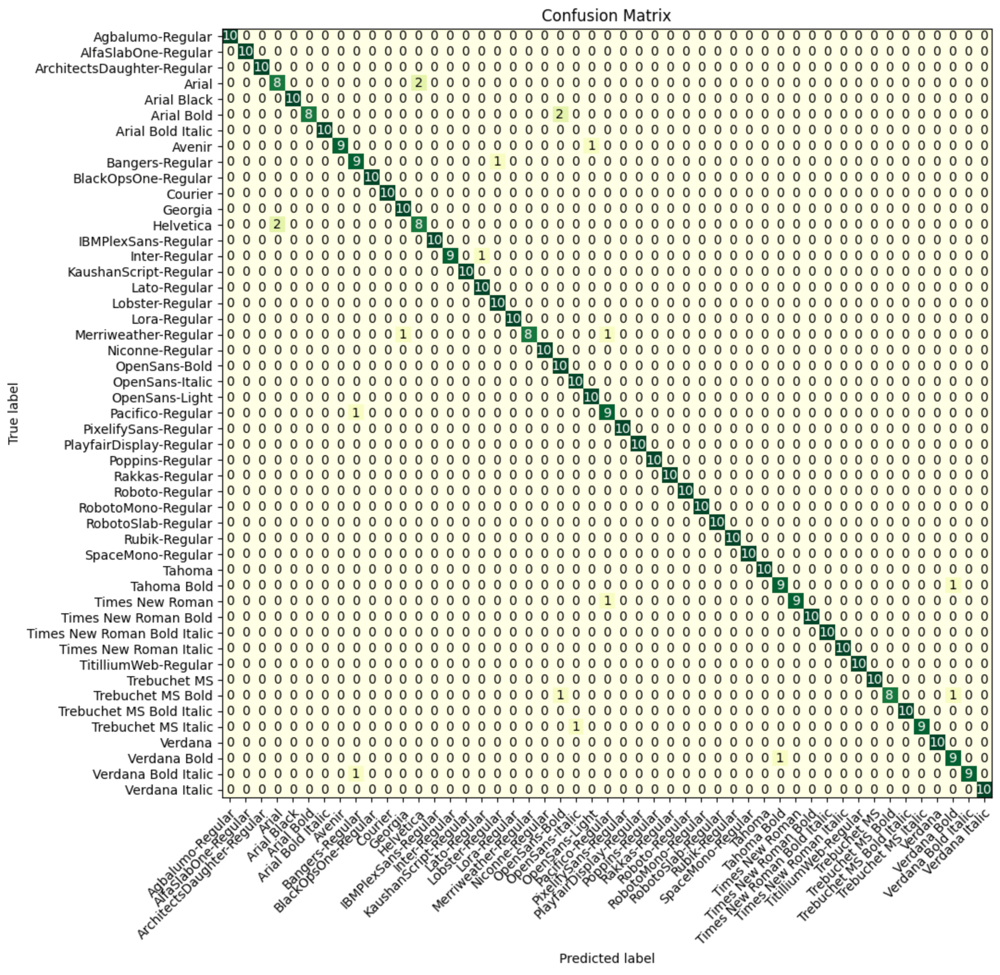

# font-identifier

This model is a fine-tuned version of [microsoft/resnet-18](https://huggingface.co/microsoft/resnet-18) on the imagefolder dataset.
Result: Loss: 0.1172; Accuracy: 0.9633

Try with any screenshot of a font, or any of the examples in [the 'samples' subfolder of this repo](https://huggingface.co/gaborcselle/font-identifier/tree/main/hf_samples).

## Model description

Identify the font used in an image. Visual classifier based on ResNet18.

I built this project in 1 day, with a minute-by-minute journal [on Twitter/X](https://twitter.com/gabor/status/1722300841691103467), [on Pebble.social](https://pebble.social/@gabor/111376050835874755), and [on Threads.net](https://www.threads.net/@gaborcselle/post/CzZJpJCpxTz).

The code used to build this model is in this github rep

## Intended uses & limitations

Identify any of 48 standard fonts from the training data.

## Training and evaluation data

Trained and eval'd on the [gaborcselle/font-examples](https://huggingface.co/datasets/gaborcselle/font-examples) dataset (80/20 split).

## Training procedure

### Training hyperparameters

The following hyperparameters were used during training:
- learning_rate: 5e-05
- train_batch_size: 16
- eval_batch_size: 16
- seed: 42
- gradient_accumulation_steps: 4
- total_train_batch_size: 64
- optimizer: Adam with betas=(0.9,0.999) and epsilon=1e-08
- lr_scheduler_type: linear
- lr_scheduler_warmup_ratio: 0.1
- num_epochs: 50

### Training results

| Training Loss | Epoch | Step | Validation Loss | Accuracy |
|:-------------:|:-----:|:----:|:---------------:|:--------:|
| 4.0243        | 0.98  | 30   | 3.9884          | 0.0204   |
| 0.8309        | 10.99 | 338  | 0.5536          | 0.8551   |
| 0.3917        | 20.0  | 615  | 0.2353          | 0.9388   |
| 0.2298        | 30.99 | 953  | 0.1326          | 0.9633   |
| 0.1804        | 40.0  | 1230 | 0.1421          | 0.9571   |
| 0.1987        | 46.99 | 1445 | 0.1250          | 0.9673   |
| 0.1728        | 48.0  | 1476 | 0.1293          | 0.9633   |
| 0.1337        | 48.78 | 1500 | 0.1172          | 0.9633   |

### Confusion Matrix

Confusion matrix on test data.

### Framework versions

- Transformers 4.36.0.dev0
- Pytorch 2.0.0
- Datasets 2.12.0
- Tokenizers 0.14.1